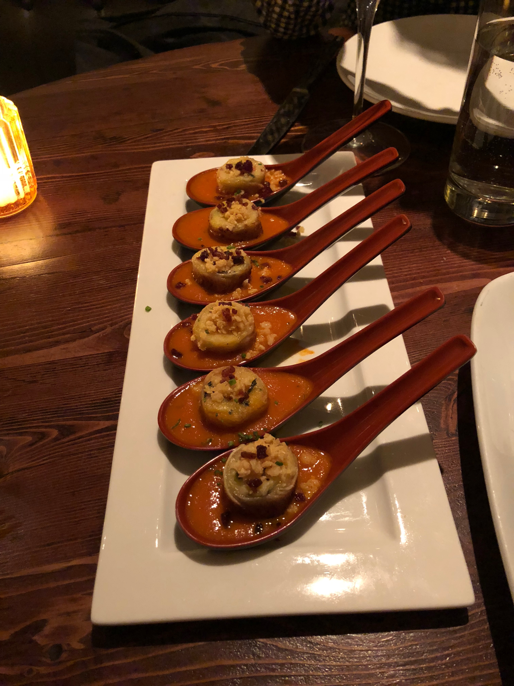
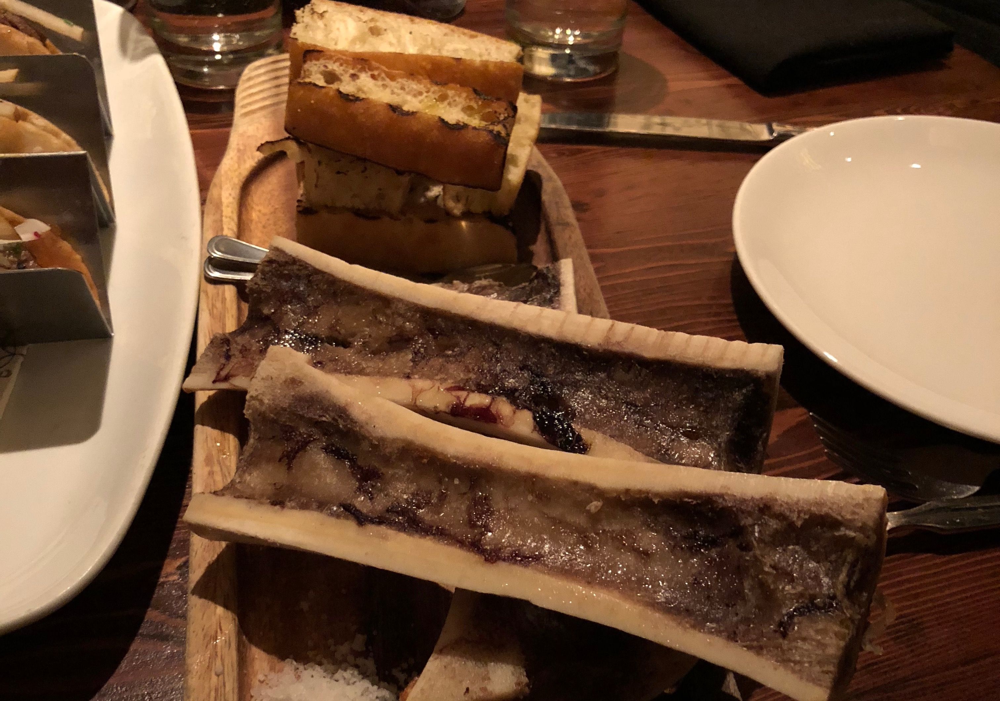
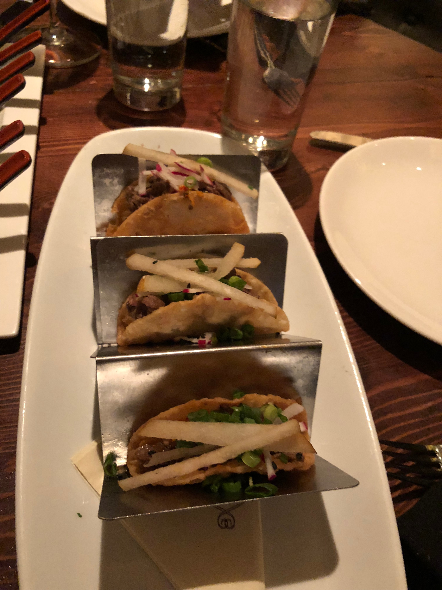
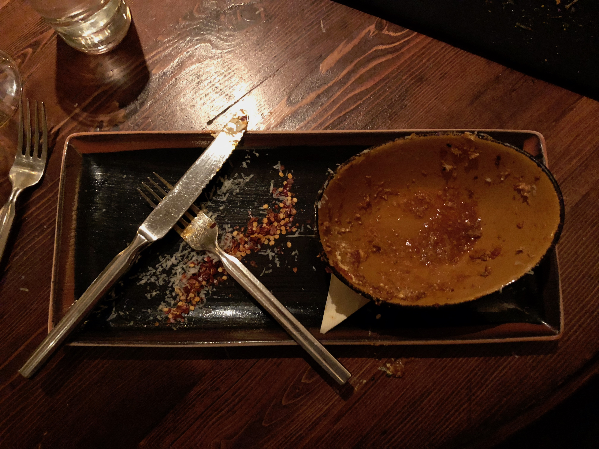

### Grilled Cheese Soup Dumplings

### Bone Marrow

### Bulgogi Tacos

### Garganelli

This is one of my favorite spots to go for a nice nice meal, with family or friends. The menu is huge and they add new stuff all the time. The appetizers we got were all amazing. My favorite was either the bone marrow or the dumplings. The tacos were good, but the other two were absolutely amazing. The dumplings were nostalgic of one of my favorite meals (tomato soup and grilled cheese) and the bone marrow was delicious. My favorite though, was the garganelli. I loved it so much all I got was a picture of a clean plate. It was so flavorful and may be one of the best pasta dishes I've had. If you're ever looking for an expensive meal that's worth the money, this is it.

Rating: 9/10