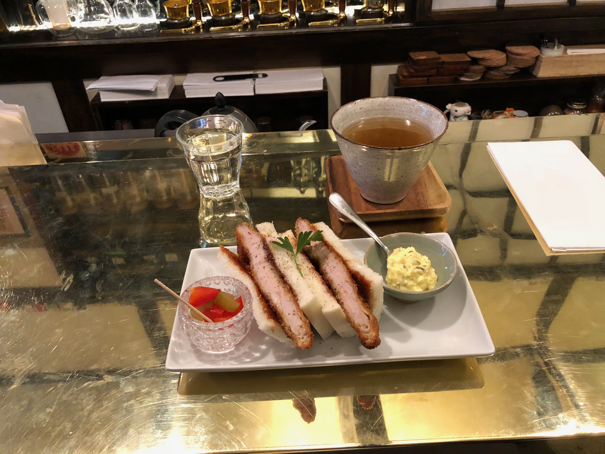
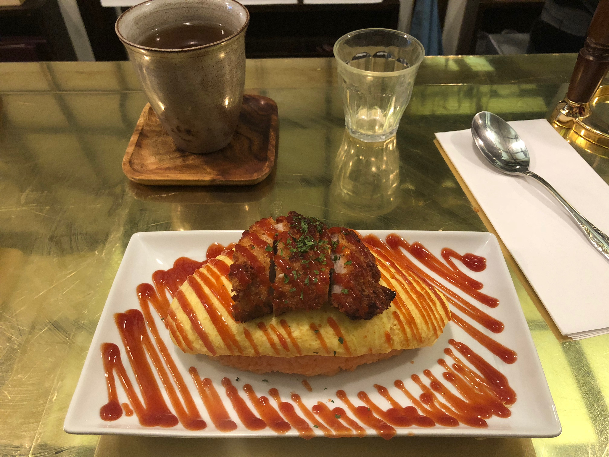

### Katsu Sandwich

### Omurice

This is a great spot for some authentic japanese cuisine. Their menu is relatively small, but it's really amazing. I got the katsu sandwich the first time I went, paired with their house tartar sauce and their katsu sauce (ask for some more on the side!) it was perfect. I went back again recently and ordered the omurice with a piece of their katsu which was also fantastic; it was filling, flavorful, and simple. Price was it's reasonable ~$13 for your meal, maybe a bit expensive, but pretty worth it. The ambience is also really great, they play jazz in the restaurant, you sit at a golden bar, and tea and coffee sets fill the room.

Rating 8/10