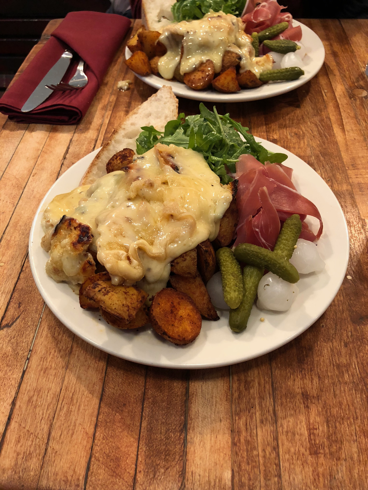

# Raclette

Today I went to Raclette in the lower east side, and had their namesake; raclette! Basically it's roasted potatoes, prosciutto, some random vegetables and a side salad, with some very melty cheese on top of it. I got the porcini raclette swiss cheese. Overall it was pretty good, but definitely overpriced. It was around $23 if memory serves, which given the size and the taste was too much. I'd say it was worth $13 maximum. 

Rating: 7/10