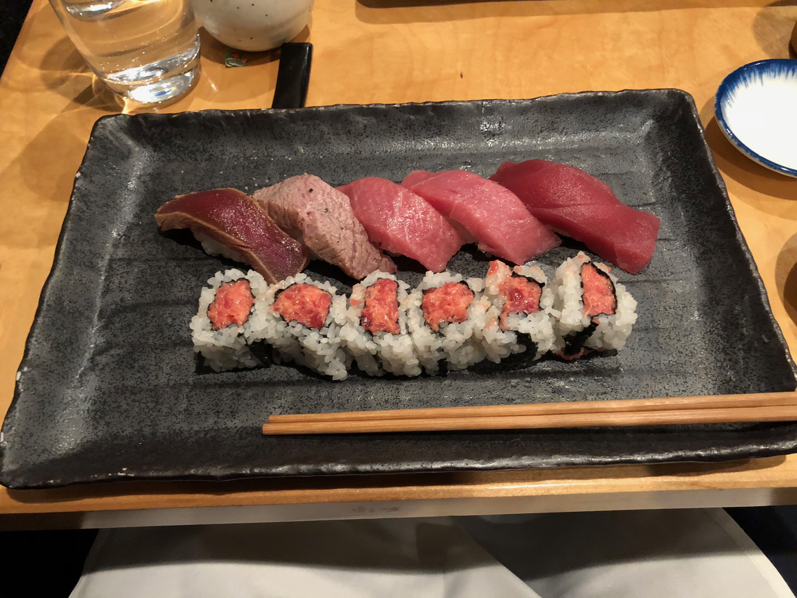

### Tuna Special

As far as Omakase goes, Ushiwakamaru is supposed to be one of the best in the city, which is what led me to it in the first place. When I got there I was surprised to find out that the price for omakase is $135, which is not what my friend and I were financially prepared for (at least not that night) so we decided to sit down at a normal table instead of the sushi bar, and order off the regular menu. We got the tuna special which consisted of five pieces of Nigiri and one spicy tuna roll. The nigiri, from left to right are: aged toro, seared tuna, extra fatty toro, fatty toro, and regular toro. The nigiri was absolutely amazing, and the spicy tuna roll may have been one of the tastiest I've had in a while; it just melted in your mouth, but still had tons of spiciness and flavor to it. The price was ehhhh ($45), but I never expect sushi to be cheap.

Rating: 8/10